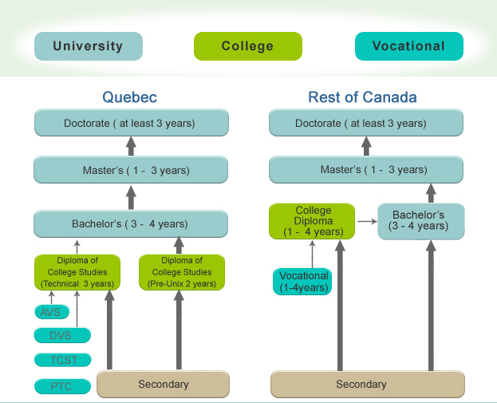
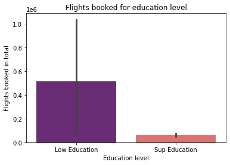

## A/B test

The aim of this test is to verify if there is any relation between the level of studies and the flights booked by the clients. 

The metrics which we're working for this A/B test are 'education' and 'flights_booked'. In future steps a new data frame collecting both categories will be created in order to have the information more accessible and classified for the test that is being conducted.

We've exploreded in first place the number of flights booked for each education level and the descriptive statistics as first approac to the data. We are also able to confirm the education levels we have (Bachelor, College, Master, Doctor and High School or Below).

As mentioned a new Data Frame is created (df_filtered).The education levels were clasified in two categories and a new column was added to our dataframe dividing the levels into Sup Education (Doctor and Master) and Low Education the remaining levels. The division was made according to the Canadian education system clasification: 

*Source: impeloverseas.com*

According to this information a second exploration of the data was made and displayed. The number of flights booked by those in Low Education is higher than the ones in Sup Education. 

As the great number of data Kolmogorov-Smirnov test was conducted as this methods works better with great numbers. Data do not belong to a normal distribution according to the test. There is no prorportion on how the information is divided. 