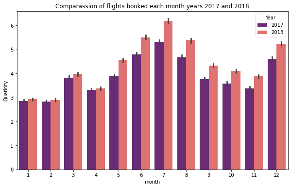
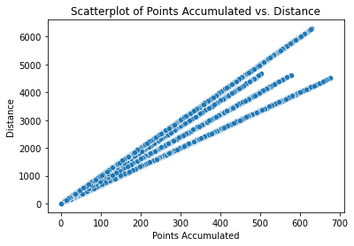
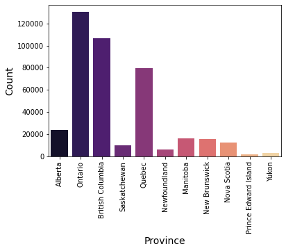
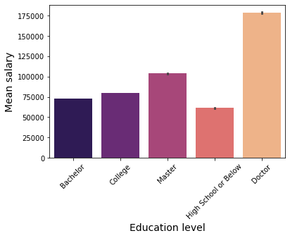
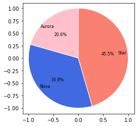
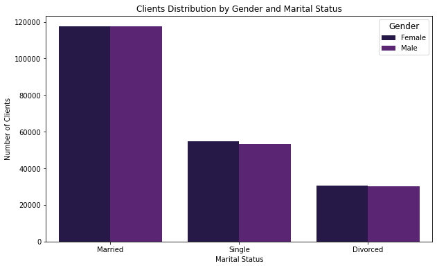

## Visualisation

After loading the previously prepared data, the client's questions were answered. These are the main conclusions: 

1. How is the number of flights booked per month distributed over the year?

The pattern is the same for both years (2017 and 2018). The month with the highest concentration of flights booked is July, followed by June, August and May. We can therefore easily conclude that the summer months are the most desirable for customers to travel. There's also a peak in December and March. 

We can also conclude that the number of flights has increased in this period as the flights reservations were more in 2018. 

A detailed study of the most popular months could be carried out with the necessary data, as it will provide the company with further information to, for example, offer more flights on these days and be prepared.

2. Is there a link between the distance flown and the number of points collected?

Yes, the longer the distance, the more points are accumulated. There's an increasing tendency and a relationship within both variables. 

3. What is the distribution of clients by province or state?

Ontario is the province with the most customers, followed by British Columbia and Quebec. 

It would be nice for the company to see where these customers travel to, to check if there's a preferred destination. On the other hand, it would also be good to explore in more detail if this data is related to the population density for these provinces, the flight destinations in each of them or if there is any other possible reason that justifies this customer distribution, so that the marketing team, for example, can focus its efforts on these areas. 

4. What is the average wage of clients with different levels of education?

Those with a university degree have a higher salary. The difference is even more significant within those who have a doctorate. 

In these questions it's necessary to remember that a pattern was detected in the previous research as there was no data for those in college and the data reflected is the mean. It would be great to work with data engineers to work out the cause of this error and get it fixed in order to operate with more accurate data. However, the pattern is quite clear. 

5. What is the proportion of customers with different types of loyalty cards?

Almost half of the customers (46.5%) have a Start card, followed by Nova (33.9&) and Aurora (20.6%). 

6. How are clients distributed according to their civil status and gender?

Must be noted that the number of married clients is higher than the other marital statuses. Besides this, the genres are evenly distributed along all the registered marital statuses. 